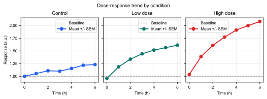
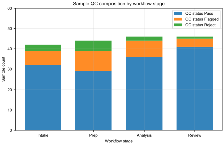
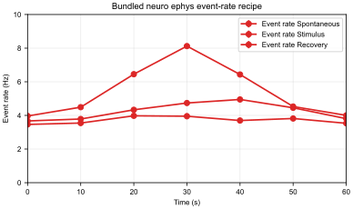

# FigStudio

FigStudio is a local-first figure workflow for scientific Python users who want to turn data already present in a script or notebook into polished, reproducible Matplotlib panels.

It opens a browser editor from your Python process, lets you map live variables to plot layers or statistics recipes, create faceted DataFrame panels, add reference lines and annotations, previews through Matplotlib, exports publication files, and saves plain Matplotlib OO code back to a controlled script block or notebook cell.

## Install

```powershell
pip install figstudio
```

The wheel includes the React editor. End users do not need Node, npm, Vite, or the frontend source tree after installation.

## Try It

```powershell
figstudio demo
```

For a script, add FigStudio after data preparation and give generated plotting code one controlled block:

```python
import figstudio

# Prepare data first.
session = figstudio.open(locals(), script_path=__file__, block_id="main")

# figstudio:start main
# figstudio:end main
```

In the editor, choose a live variable, add a plot layer or statistics recipe, polish the figure, export PNG/SVG/PDF, then click **Save code**.

## Gallery Preview

This minimal screenshot set is checked in and reproducible. Each preview below is generated from a gallery script plus its portable `.figstudio.json` contract; the full gallery includes more plot types and layout examples.

| Workflow | Screenshot | Reproduce |
| --- | --- | --- |
| Faceted dose response |  | `uv run python examples/gallery/faceted_dose_response.py`<br>[script](examples/gallery/faceted_dose_response.py) / [spec](examples/gallery/faceted_dose_response.figstudio.json) |
| Stacked bar sample composition |  | `uv run python examples/gallery/stacked_bar_sample_composition.py`<br>[script](examples/gallery/stacked_bar_sample_composition.py) / [spec](examples/gallery/stacked_bar_sample_composition.figstudio.json) |
| Neuro ephys event rate |  | `uv run python examples/gallery/neuro_ephys_event_rate.py`<br>[script](examples/gallery/neuro_ephys_event_rate.py) / [spec](examples/gallery/neuro_ephys_event_rate.figstudio.json) |

Short workflow GIF references stay tied to the same checked-in examples, so recorded demos do not depend on hidden data:

| GIF reference | Source workflow | Capture path |
| --- | --- | --- |
| Data to faceted preview | [faceted_dose_response.py](examples/gallery/faceted_dose_response.py) / [preview](docs/assets/gallery/faceted-dose-response.svg) | launch the script, select the repeated-measures DataFrame, render the three-panel preview, then export SVG |
| Recipe to export artifact | [stacked_bar_sample_composition.py](examples/gallery/stacked_bar_sample_composition.py) / [preview](docs/assets/gallery/stacked-bar-sample-composition.svg) | launch the script, inspect the stacked recipe mapping, preview grouped counts, then export SVG |
| Domain recipe proof | [neuro_ephys_event_rate.py](examples/gallery/neuro_ephys_event_rate.py) / [preview](docs/assets/gallery/neuro-ephys-event-rate.svg) | launch the script, inspect the bundled neuro recipe, preview mean/SEM event rates, then export SVG |

## Documentation

| Language | Start here |
| --- | --- |
| English | [docs/en/index.md](docs/en/index.md) |
| Chinese / 中文 | [docs/zh/index.md](docs/zh/index.md) |

Common entry points:

| Reader | English | 中文 |
| --- | --- | --- |
| Figure users | [Get Started](docs/en/getting-started.md) | [快速开始](docs/zh/getting-started.md) |
| Scientific workflows | [Workflows](docs/en/scientific-workflows.md) | [科研制图工作流](docs/zh/scientific-workflows.md) |
| Example gallery | [Gallery](docs/en/gallery.md) | [Gallery](docs/zh/gallery.md) |
| API consumers | [API Reference](docs/en/reference/api.md) | [API 参考](docs/zh/reference/api.md) |
| Contributors | [Developer Guide](docs/en/contributing/developer-guide.md) | [开发者指南](docs/zh/contributing/developer-guide.md) |
| Product scope | [PRD](docs/en/product/prd.md) | [产品需求](docs/zh/product/prd.md) |
| Roadmap overview | [Roadmap](docs/en/product/roadmap.md) | [路线图](docs/zh/product/roadmap.md) |
| Roadmap strategy | [Strategy](docs/en/product/roadmap/strategy.md) | [路线图策略](docs/zh/product/roadmap/strategy.md) |
| Roadmap initiatives | [Initiatives](docs/en/product/roadmap/initiatives.md) | [路线图 Initiatives](docs/zh/product/roadmap/initiatives.md) |
| Deferred roadmap items | [Deferred Work](docs/en/product/roadmap/deferred.md) | [暂缓事项](docs/zh/product/roadmap/deferred.md) |
| Release history | [Release Notes](docs/en/product/release-notes.md) / [CHANGELOG](CHANGELOG.md) | [发布说明](docs/zh/product/release-notes.md) / [CHANGELOG](CHANGELOG.md) |

## Development

```powershell
uv run --extra dev pytest
cd frontend
npm install
npm run build
npm run dev
```

Build a publishable package:

```powershell
uv build
```

The build hook bundles the frontend into the Python wheel. Runtime installs from a built wheel still use the packaged editor and do not require frontend tooling.
