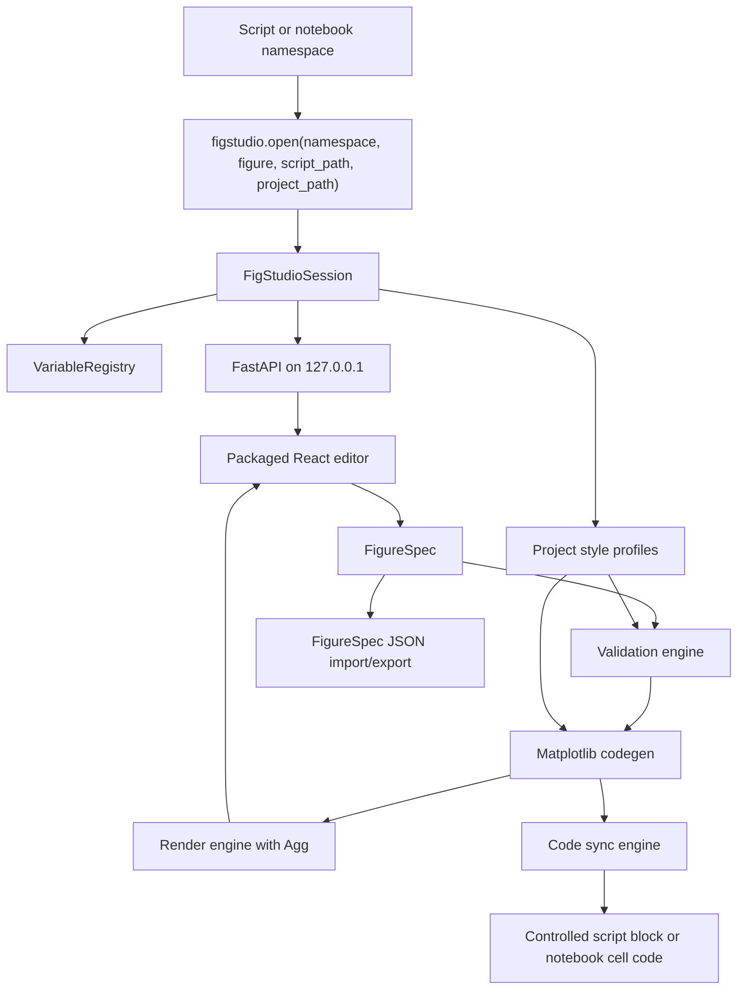

# Technical Design

This document is the implementation baseline for the public beta. User tutorials live in the user docs, API details live in the [API reference](../reference/api.md), and future work lives in the [roadmap](../product/roadmap.md).

## Architecture

FigStudio is a Python-owned local application with a React editor. Python owns data access, facet value lookup, validation, Matplotlib rendering, code generation, export, controlled writeback, and packaged static serving. React owns editor state, variable/layer/recipe/facet controls, secondary-axis controls, reference lines, annotations, preview display, validation display, FigureSpec import/export, and user actions.

## Module Responsibilities

- `session.py`: creates `FigStudioSession`, resolves the project root, chooses a localhost port, starts Uvicorn, opens the browser, and inspects an optional existing figure.
- `registry.py`: stores live Python objects and exposes safe `VariableSummary` records to the UI.
- `models.py`: defines Pydantic request, response, error, session, validation, and FigureSpec models.
- `layers.py` and `recipes.py`: define bundled layer and recipe registries that feed editor catalogs, validation capability, and codegen dispatch while preserving the public `PlotKind` and `RecipeKind` contracts.
- `style_profiles.py`: loads `.figstudio/styles.json`, reports non-fatal warnings, and resolves profile defaults without mutating `FigureSpec`.
- `validation.py`: validates layout geometry, missing variables/columns, non-DataFrame recipe or filter sources, missing axes, facet filters, secondary Y-axis layer compatibility, dimension mismatches, 2D requirements, and primary or secondary log-scale positivity, while adding field-level repair suggestions when context is available.
- `codegen.py`: converts `FigureSpec` into plain Matplotlib OO code with no FigStudio runtime dependency.
- `render.py`: executes generated code with the live namespace under the Agg backend and returns preview/export bytes.
- `sync.py`: replaces one unique controlled script block and rejects unsafe marker states.
- `server.py`: exposes the local FastAPI app, facet value lookup, and packaged React editor.
- `spec_io.py`: loads and saves portable `.figstudio.json` FigureSpec files.

## Data Flow

1. User code calls `figstudio.open(locals(), ...)`.
2. `VariableRegistry` filters private names and summarizes supported values.
3. `FigStudioSession` resolves the project root from `project_path`, `script_path`, or current working directory.
4. The FastAPI app serves the React editor and `/api/*` endpoints on `127.0.0.1`.
5. The editor loads project style profiles plus bundled layer/recipe catalogs, then builds or imports a `FigureSpec`.
6. Backend validation checks the spec against the live namespace and loaded profile ids, then returns structured issues with optional repair suggestions.
7. Codegen resolves effective profile values and creates Matplotlib OO code.
8. Render/export executes the generated code with Agg.
9. Save code either replaces a controlled script block or returns notebook replacement code.

## Safety Decisions

- The local server binds to `127.0.0.1` by default.
- The UI receives summaries, not direct serialized copies of arbitrary Python objects.
- FigureSpec recipe, facet, repeated-panel, and secondary-axis entries store intent, column references, equality filters, selections, labels, and axis settings, not raw DataFrame contents.
- Generated plotting code must not import or require FigStudio.
- Generated plotting code must contain resolved profile values as plain Matplotlib arguments, not runtime profile lookups.
- Script writeback replaces only one unique controlled block and rejects missing, duplicate, unmatched, or nested markers.
- Notebook workflows return replacement code and do not mutate notebook files.
- Existing Figure support is inspection plus generated editable layers for supported artists, not source-code recovery.
- API failures use structured error payloads for validation, render, export, and writeback paths.

## Packaging

The Python wheel includes the built React app under `figstudio/static`. The FastAPI server first serves that package directory and only falls back to source-tree `frontend/dist` during development.

The Hatch custom build hook runs `npm ci` in clean checkouts, reuses existing local `frontend/node_modules` when present, runs `npm run build`, and copies `frontend/dist` into `src/figstudio/static`. `FIGSTUDIO_SKIP_FRONTEND_BUILD=1` skips the npm build step but still copies an existing `frontend/dist`.

## Verification

- Backend behavior: `uv run --extra dev pytest`.
- Frontend build: `cd frontend`; `npm run build`.
- Frontend bundle guard: `cd frontend`; `npm run check:bundle`.
- Browser smoke: `cd frontend`; `npm run test:e2e`.
- Package build: `uv build`.
- Installed wheel smoke: create a clean venv, install `dist\figstudio-*.whl`, run `figstudio demo --no-browser`, then fetch `/` and `/api/session` from `127.0.0.1`.
