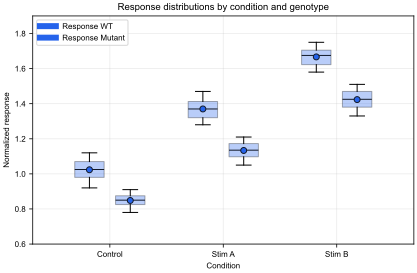
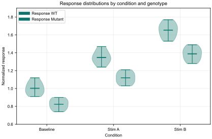

# Gallery

This gallery is a small, checked-in proof set for current beta features. Each workflow has a runnable Python script, a companion `.figstudio.json` figure contract, and an SVG preview generated from that contract.

Run a workflow script from the repository root to open the live editor:

```powershell
uv run python examples/gallery/faceted_dose_response.py
```

The companion specs are portable FigStudio state. They store variable names, columns, panel layout, filters, selections, reference lines, annotations, and style choices, not raw data.

## Faceted Dose Response


| Item | Details |
| --- | --- |
| Files | [script](../../examples/gallery/faceted_dose_response.py), [spec](../../examples/gallery/faceted_dose_response.figstudio.json) |
| Demonstrates | DataFrame-backed facet filters, `mean_sem_line` recipes, shared axes, reference lines, journal double-column sizing |
| Data shape | Synthetic repeated-measures DataFrame with `condition`, `replicate`, `time`, and `response` columns |
| Figure contract | Three panels filter the same `df` by condition and generate plain Matplotlib recipe code from live DataFrame columns |

## Stacked Bar Sample Composition


| Item | Details |
| --- | --- |
| Files | [script](../../examples/gallery/stacked_bar_sample_composition.py), [spec](../../examples/gallery/stacked_bar_sample_composition.figstudio.json) |
| Demonstrates | `stacked_bar` recipes, grouped count aggregation, publish-mode labels, SVG export readiness checks |
| Data shape | Synthetic sample QC DataFrame with `sample_id`, `stage`, and `qc_status` columns |
| Figure contract | One recipe groups the live `df` by workflow stage and QC status, stacks counts as plain Matplotlib bars, and stays clean for SVG export-context validation |

## Category Boxplot Response



| Item | Details |
| --- | --- |
| Files | [script](../../examples/gallery/category_boxplot_response.py), [spec](../../examples/gallery/category_boxplot_response.figstudio.json) |
| Demonstrates | `boxplot_by_category` recipes, grouped distribution summaries, publish-mode labels, SVG export readiness checks |
| Data shape | Synthetic response DataFrame with `condition`, `genotype`, `replicate`, and `response` columns |
| Figure contract | One recipe groups live `df` values by condition and genotype, offsets Matplotlib boxplots by group, and keeps the generated code independent of FigStudio |

## Category Violin Response



| Item | Details |
| --- | --- |
| Files | [script](../../examples/gallery/category_violin_response.py), [spec](../../examples/gallery/category_violin_response.figstudio.json) |
| Demonstrates | `violin_by_category` recipes, grouped distribution summaries, publish-mode labels, SVG export readiness checks |
| Data shape | Synthetic response DataFrame with `condition`, `genotype`, `replicate`, and `response` columns |
| Figure contract | One recipe groups live `df` values by condition and genotype, offsets Matplotlib violins by group, and keeps the generated code independent of FigStudio |

## Secondary-Axis Timecourse


| Item | Details |
| --- | --- |
| Files | [script](../../examples/gallery/secondary_axis_timecourse.py), [spec](../../examples/gallery/secondary_axis_timecourse.figstudio.json) |
| Demonstrates | Left/right Y-axis overlay, combined legend, vertical reference lines, arrow annotation, export-ready sizing |
| Data shape | One DataFrame with aligned `time`, `fluorescence`, `event_rate`, and `stimulus` columns |
| Figure contract | The fluorescence line stays on the primary axis while event rate renders on `AxesSpec.secondary_y` |

## Spanned Layout Signal Map


| Item | Details |
| --- | --- |
| Files | [script](../../examples/gallery/spanned_layout_signal_map.py), [spec](../../examples/gallery/spanned_layout_signal_map.figstudio.json) |
| Demonstrates | GridSpec span output, heatmap colorbar, mapping-key repeated panel selections, annotations, baseline reference lines |
| Data shape | Shared `time`, a `signal_map` dictionary, and a 2D `spectral_power` array |
| Figure contract | A large heatmap spans two rows while selected mapping entries render as separate trace panels |

## Verification

The gallery examples are covered by `tests/test_gallery_examples.py`. The test imports each script without opening the editor, loads the companion spec, validates it against the script namespace, and runs Matplotlib code generation.
