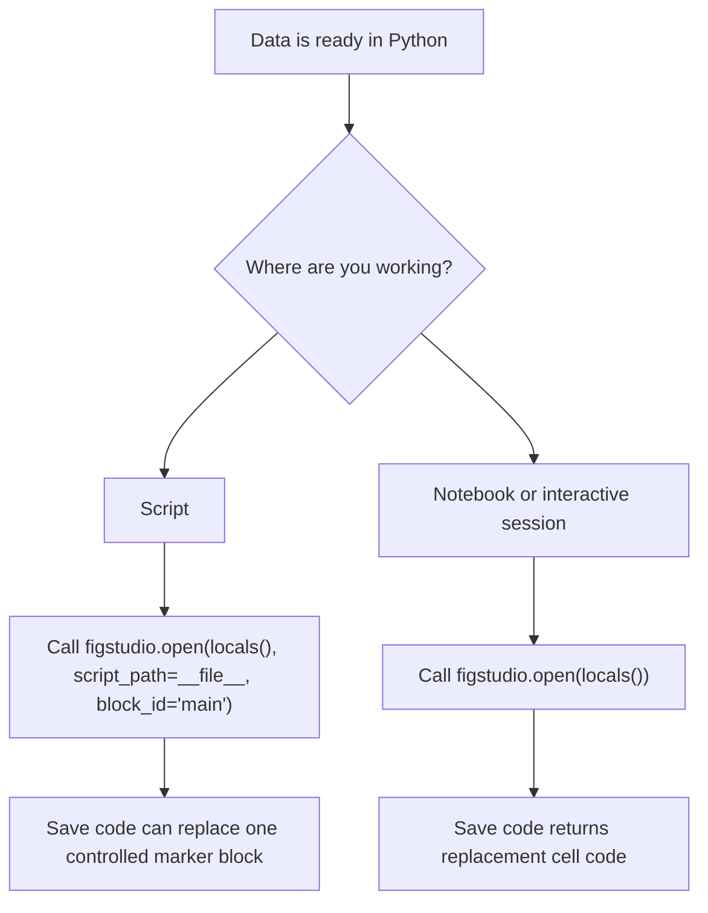

# Get Started

This page gets a scientific Python user from installation to a first editable Matplotlib figure.

## Install

```powershell
pip install figstudio
```

The package includes the browser editor. You do not need Node, npm, Vite, or the frontend source tree after installing a built wheel.

## Run The Demo

```powershell
figstudio demo
```

The command starts a local server on `127.0.0.1`, prints the editor URL, and opens the browser unless you pass `--no-browser`.

## Choose A Launch Path



## First Script Session

Put FigStudio after data preparation and reserve one marker block for generated plotting code:

```python
import figstudio

# Load, clean, and summarize your data above this line.
session = figstudio.open(locals(), script_path=__file__, block_id="main")

# figstudio:start main
# figstudio:end main
```

When you click **Save code**, FigStudio only replaces the code between the matching markers. It does not edit imports, data loading, filtering, modeling, or other code outside the controlled block.

Use a different `block_id` for each generated figure in the same script.

## First Notebook Session

In a notebook or interactive session, omit `script_path`:

```python
import figstudio

session = figstudio.open(locals())
```

The editor can still map data, render previews, export files, and generate code. **Save code** returns replacement cell code in the response and code panel instead of mutating the notebook file.

## Build The First DataFrame Plot

1. Finish data loading, cleaning, filtering, modeling, and summary calculation before opening FigStudio.
2. Select a pandas DataFrame in the left **Variables** panel.
3. Choose **Plot layer** for a direct plot or **Stats recipe** for a common statistical panel.
4. Pick the plot type, or choose a research-question recipe group and recipe.
5. Map X/Y/value columns.
6. Click **Add layer** or **Add recipe** and wait for the Matplotlib preview.
7. Move to [Scientific Workflows](scientific-workflows.md) when the first preview renders.

Supported public variable summaries include pandas DataFrames and Series, NumPy arrays, lists, tuples, and Matplotlib Figures. Variables whose names start with `_` are hidden.
