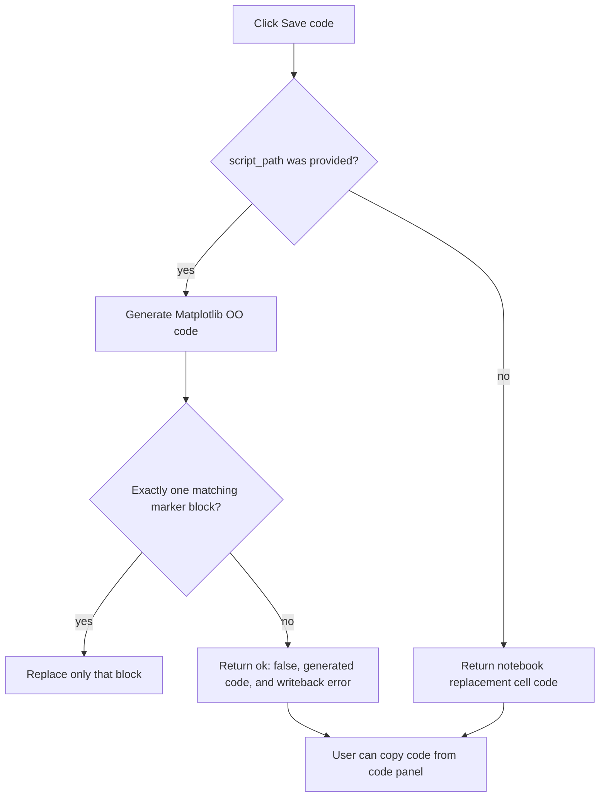

# Save, Export, Reuse

Use this page when the figure is ready to leave the editor and become code, files, or a reusable editing session.

## Safe Code Save



Script writeback may only replace a unique controlled block:

```python
# figstudio:start main
# generated code goes here
# figstudio:end main
```

FigStudio rejects missing blocks, duplicated blocks for the same id, nested markers, unmatched markers, and IO failures. It does not edit outside the controlled block.

Notebook-style sessions return replacement cell code and do not mutate notebook files.

## Export Files

Use the PNG, SVG, or PDF export buttons from the preview toolbar. Exports are generated by Matplotlib Agg from the current `FigureSpec`, so exported files match the generated Matplotlib code path rather than a browser approximation.

If export fails, fix validation issues first. If validation passes and export still fails, check filesystem permissions when using an explicit output path.

## Reuse FigureSpec Files

Use the FigureSpec import/export buttons to save or restore a `.figstudio.json` GUI session.

A `FigureSpec` stores editor state, not raw data. Reusing a spec requires a new Python session with compatible variable names, DataFrame columns, and data shapes.

Python helpers are also available:

```python
figstudio.save_spec(session.spec, "figure.figstudio.json")
spec = figstudio.load_spec("figure.figstudio.json")
```

Project style profile references also depend on compatible `.figstudio/styles.json` content in the next session. Missing profile ids warn and fall back to explicit spec values and defaults.
