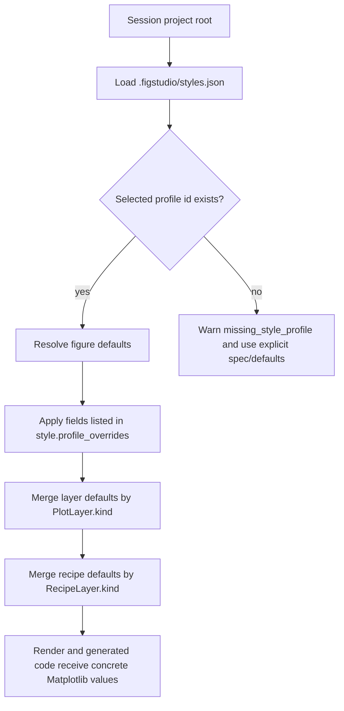

# Styles And Layouts

Use this page when the figure needs manuscript sizing, consistent project defaults, or multi-panel layout.

## Built-In Figure Presets

FigStudio records the built-in figure preset in `FigureStyle.preset`. Current values are `custom`, `journal_single`, `journal_double`, `poster`, and `slide`.

Presets are starting points. You can still edit figure width, height, DPI, font family, font size, and constrained layout.

## Panel Layouts

Panel layout presets include single panel, two columns, two rows, two by two, large left, and large top.

The editor stores layout as axes geometry: `row`, `col`, `rowspan`, and `colspan`. Dense one-cell-per-axes grids generate simpler `plt.subplots` code. Spanned or non-dense layouts generate Matplotlib `GridSpec` code.

Full `subplot_mosaic` authoring is not part of the current schema.

## Project Style Profiles

A project can provide shared figure, layer, and recipe defaults in `.figstudio/styles.json` under the session project root:

```json
{
  "version": 1,
  "profiles": [
    {
      "id": "manuscript",
      "label": "Manuscript",
      "description": "Compact manuscript defaults",
      "figure": {
        "width": 3.35,
        "height": 2.45,
        "dpi": 300,
        "font_family": "Arial",
        "font_size": 8,
        "constrained_layout": true
      },
      "layers": {
        "line": { "color": "#2563eb", "linewidth": 1.6 }
      },
      "recipes": {
        "mean_sem_line": { "color": "#2563eb", "linewidth": 1.6 }
      }
    }
  ]
}
```

When `script_path` is provided, FigStudio looks under the script directory. Without `script_path`, it uses the current working directory. Pass `project_path` to `figstudio.open(...)` or CLI `--project` to choose a different root.

## Profile Resolution



Selecting a profile stores `style.profile_id` in the `FigureSpec`. Profile values are not copied into the spec.

If you manually edit a governed figure field such as width, height, DPI, font family, font size, or constrained layout, FigStudio records that field in `style.profile_overrides` so the manual value wins.

Layer and recipe style defaults are resolved by kind. Explicit non-null style fields on the layer or recipe override inherited profile defaults.
