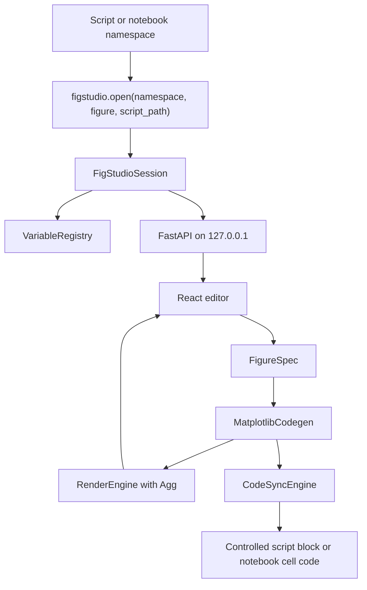

# FigStudio Technical Design / 技术设计

## Architecture / 架构

FigStudio is a Python-owned local application with a React editor. Python owns data access, Matplotlib rendering, code generation, export, and controlled writeback. React owns editor state, variable/layer controls, preview display, and user actions.

FigStudio 是一个 Python 负责核心能力、本地 React 负责编辑界面的应用。Python 负责数据访问、Matplotlib 渲染、代码生成、导出和受控写回；React 负责编辑器状态、变量/图层控件、预览展示和用户操作。



## Public API / 公共 API

```python
figstudio.open(
    namespace=None,
    *,
    figure=None,
    script_path=None,
    block_id="main",
    mode="auto",
    open_browser=True,
) -> FigStudioSession
```

- `namespace`: usually `locals()`, kept server-side; the UI receives summaries only.
- `figure`: optional Matplotlib `Figure` for best-effort inspection.
- `script_path`: enables controlled `.py` writeback.
- `block_id`: selects `# figstudio:start <block_id>` and `# figstudio:end <block_id>`.
- `open_browser`: opens the local editor URL when true.

- `namespace`：通常传入 `locals()`，只保存在服务端；UI 只收到摘要。
- `figure`：可选 Matplotlib `Figure`，用于 best-effort inspection。
- `script_path`：启用 `.py` 文件受控写回。
- `block_id`：选择 `# figstudio:start <block_id>` 和 `# figstudio:end <block_id>`。
- `open_browser`：为 true 时打开本地编辑器 URL。

## Data Model / 数据模型

- `VariableRegistry` stores live Python objects and exposes `VariableSummary` objects for safe UI inspection.
- `FigureSpec` is the source of truth for figure dimensions, axes, layers, annotations, and style.
- `DatasetRef` supports both DataFrame column mapping and independent variable mapping through channel fields such as `x_variable`, `y_variable`, `z_variable`, and `yerr_variable`.
- `MatplotlibCodegen` converts `FigureSpec` to plain Matplotlib OO code.

- `VariableRegistry` 保存真实 Python 对象，并向 UI 暴露安全的 `VariableSummary`。
- `FigureSpec` 是图尺寸、坐标轴、图层、注释和样式的唯一状态源。
- `DatasetRef` 通过 `x_variable`、`y_variable`、`z_variable`、`yerr_variable` 等通道字段，同时支持 DataFrame 列映射和独立变量映射。
- `MatplotlibCodegen` 将 `FigureSpec` 转换为纯 Matplotlib OO 代码。

## API Surface / API 面

- `GET /api/session`: session metadata and writeback capability.
- `GET /api/variables`: safe variable summaries.
- `GET /api/spec`: current `FigureSpec`.
- `POST /api/spec`: update current spec and render SVG preview.
- `POST /api/render`: render PNG or SVG preview.
- `POST /api/save-code`: write a controlled script block or return notebook replacement code.
- `POST /api/export`: return base64 export data or write to an explicit output path.
- `WS /api/events`: reserved lightweight event channel.

- `GET /api/session`：会话元数据和写回能力。
- `GET /api/variables`：安全变量摘要。
- `GET /api/spec`：当前 `FigureSpec`。
- `POST /api/spec`：更新 spec 并渲染 SVG 预览。
- `POST /api/render`：渲染 PNG 或 SVG 预览。
- `POST /api/save-code`：写入受控脚本块，或返回 Notebook 替换代码。
- `POST /api/export`：返回 base64 导出数据，或写入明确指定的输出路径。
- `WS /api/events`：预留轻量事件通道。

## Safety Decisions / 安全决策

- The local server binds to `127.0.0.1` by default.
- Generated plotting code must not import or require FigStudio.
- Script writeback replaces only one unique controlled block and rejects missing, duplicate, or nested markers.
- Notebook workflows return replacement code and do not mutate notebook files.
- Existing Figure support is inspection plus generated editable layers for supported artists, not source-code recovery.
- API failures use structured error payloads for render, export, and writeback paths.

- 本地服务默认绑定 `127.0.0.1`。
- 生成绘图代码不得导入或依赖 FigStudio。
- 脚本写回只替换唯一受控块，并拒绝缺失、重复或嵌套 marker。
- Notebook 工作流只返回替换代码，不直接修改 notebook 文件。
- existing Figure 支持是对可支持 artist 的 inspection 和生成可编辑图层，不做源码恢复。
- 渲染、导出和写回路径使用结构化错误响应。

## Verification / 验证

- Backend: `uv run pytest`.
- Frontend: `cd frontend; npm run build`.
- Smoke app: `uv run python examples\smoke_server.py`, then open `http://127.0.0.1:8765`.

- 后端：`uv run pytest`。
- 前端：`cd frontend; npm run build`。
- 冒烟应用：`uv run python examples\smoke_server.py`，然后打开 `http://127.0.0.1:8765`。
