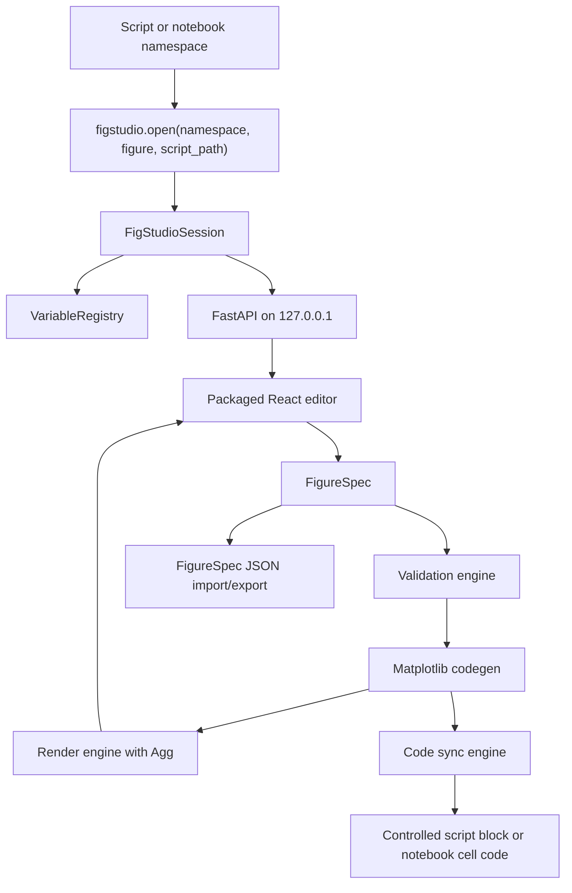

# FigStudio Technical Design / 技术设计

This document is the implementation baseline for the public beta. User-facing tutorials live in the user guide, API details live in the API reference, and future backlog lives in the roadmap.

本文是公开 beta 的实现基准。面向用户的教程放在用户指南，API 细节放在 API reference，未来 backlog 放在路线图。

## Architecture / 架构

FigStudio is a Python-owned local application with a React editor. Python owns data access, validation, Matplotlib rendering, code generation, export, controlled writeback, and packaged static serving. React owns editor state, variable and layer controls, annotations, preview display, validation display, FigureSpec import/export, and user actions.

FigStudio 是一个 Python 负责核心能力、本地 React 负责编辑界面的应用。Python 负责数据访问、校验、Matplotlib 渲染、代码生成、导出、受控写回和包内静态资源服务；React 负责编辑器状态、变量和图层控件、注释、预览展示、校验展示、FigureSpec 导入导出和用户操作。

## Module Responsibilities / 模块职责

- `session.py`: creates `FigStudioSession`, chooses a localhost port, starts Uvicorn, opens the browser, and inspects an optional existing figure.
- `registry.py`: stores live Python objects and exposes safe `VariableSummary` records to the UI.
- `models.py`: defines Pydantic request, response, error, session, validation, and FigureSpec models.
- `validation.py`: validates missing variables, missing columns, missing axes, dimension mismatches, 2D requirements, and log-scale positivity before render/export.
- `codegen.py`: converts `FigureSpec` into plain Matplotlib OO code with no FigStudio runtime dependency.
- `render.py`: executes generated code with the live namespace under the Agg backend and returns preview/export bytes.
- `sync.py`: replaces one unique controlled script block and rejects unsafe marker states.
- `server.py`: exposes the local FastAPI app and serves the packaged React editor.
- `spec_io.py`: loads and saves portable `.figstudio.json` FigureSpec files.

- `session.py`：创建 `FigStudioSession`，选择 localhost 端口，启动 Uvicorn，打开浏览器，并检查可选已有 figure。
- `registry.py`：保存真实 Python 对象，并向 UI 暴露安全的 `VariableSummary`。
- `models.py`：定义 Pydantic request、response、error、session、validation 和 FigureSpec 模型。
- `validation.py`：在渲染/导出前校验缺失变量、缺失列、缺失 axes、维度不匹配、二维数据要求和 log 坐标轴正值要求。
- `codegen.py`：把 `FigureSpec` 转换为纯 Matplotlib OO 代码，不引入 FigStudio 运行时依赖。
- `render.py`：在 Agg backend 下用 live namespace 执行生成代码，并返回预览/导出 bytes。
- `sync.py`：替换唯一受控脚本块，并拒绝不安全 marker 状态。
- `server.py`：暴露本地 FastAPI app，并服务打包后的 React 编辑器。
- `spec_io.py`：读取和保存可移植 `.figstudio.json` FigureSpec 文件。

## Data Flow / 数据流

1. User code calls `figstudio.open(locals(), ...)`.
2. `VariableRegistry` filters private names and summarizes supported values.
3. The FastAPI app serves the React editor and `/api/*` endpoints on `127.0.0.1`.
4. The editor builds or imports a `FigureSpec`.
5. Backend validation checks the spec against the live namespace.
6. Codegen creates Matplotlib OO code.
7. Render/export executes the generated code with Agg.
8. Save code either replaces a controlled script block or returns notebook replacement code.

1. 用户代码调用 `figstudio.open(locals(), ...)`。
2. `VariableRegistry` 过滤私有变量名，并摘要受支持的数据。
3. FastAPI app 在 `127.0.0.1` 服务 React 编辑器和 `/api/*` 端点。
4. 编辑器创建或导入 `FigureSpec`。
5. 后端基于 live namespace 校验 spec。
6. Codegen 生成 Matplotlib OO 代码。
7. Render/export 用 Agg 执行生成代码。
8. Save code 要么替换受控脚本块，要么返回 Notebook 替换代码。

## FigureSpec Model / FigureSpec 模型

`FigureSpec` is the editor state and codegen source of truth. It contains figure size, DPI, row/column layout, axes, layers, annotations, style, mode, and whether generated code calls `plt.show()`.

`FigureSpec` 是编辑器状态和 codegen 的唯一来源。它包含图尺寸、DPI、行列布局、axes、layers、annotations、style、mode，以及生成代码是否调用 `plt.show()`。

`PlotLayer.kind` supports `line`, `scatter`, `bar`, `barh`, `hist`, `boxplot`, `violin`, `errorbar`, `heatmap`, `contour`, `step`, and `fill_between`.

`PlotLayer.kind` 支持 `line`、`scatter`、`bar`、`barh`、`hist`、`boxplot`、`violin`、`errorbar`、`heatmap`、`contour`、`step` 和 `fill_between`。

`DatasetRef` supports both same-variable column mapping and independent variable mapping through `x_variable`, `y_variable`, `z_variable`, and `yerr_variable`. `FigureStyle.preset` records `custom`, `journal_single`, `journal_double`, `poster`, or `slide`.

`DatasetRef` 通过 `x_variable`、`y_variable`、`z_variable` 和 `yerr_variable` 同时支持同变量列映射和独立变量映射。`FigureStyle.preset` 记录 `custom`、`journal_single`、`journal_double`、`poster` 或 `slide`。

## API Surface / API 面

- `GET /api/session`: session metadata, writeback capability, optional figure tree.
- `GET /api/variables`: safe variable summaries.
- `GET /api/spec`: current `FigureSpec`.
- `POST /api/validate`: validate a `FigureSpec` against the live namespace.
- `POST /api/spec`: update current spec and render SVG preview.
- `POST /api/render`: render PNG or SVG preview.
- `POST /api/save-code`: write a controlled script block or return notebook replacement code.
- `POST /api/export`: return base64 export data or write to an explicit output path.
- `WS /api/events`: lightweight connected/ack channel reserved for editor events.

- `GET /api/session`：session metadata、写回能力和可选 figure tree。
- `GET /api/variables`：安全变量摘要。
- `GET /api/spec`：当前 `FigureSpec`。
- `POST /api/validate`：基于 live namespace 校验 `FigureSpec`。
- `POST /api/spec`：更新 spec 并渲染 SVG 预览。
- `POST /api/render`：渲染 PNG 或 SVG 预览。
- `POST /api/save-code`：写入受控脚本块，或返回 Notebook 替换代码。
- `POST /api/export`：返回 base64 export data，或写入明确指定的 output path。
- `WS /api/events`：预留轻量 connected/ack 编辑器事件通道。

See `docs/api-reference.md` for request and response details.

请求和响应细节见 `docs/api-reference.md`。

## Safety Decisions / 安全决策

- The local server binds to `127.0.0.1` by default.
- The UI receives summaries, not direct serialized copies of arbitrary Python objects.
- Generated plotting code must not import or require FigStudio.
- Script writeback replaces only one unique controlled block and rejects missing, duplicate, unmatched, or nested markers.
- Notebook workflows return replacement code and do not mutate notebook files.
- Existing Figure support is inspection plus generated editable layers for supported artists, not source-code recovery.
- API failures use structured error payloads for validation, render, export, and writeback paths.

- 本地服务默认绑定 `127.0.0.1`。
- UI 收到的是摘要，而不是任意 Python 对象的直接序列化副本。
- 生成绘图代码不得 import 或依赖 FigStudio。
- 脚本写回只替换唯一受控块，并拒绝缺失、重复、不匹配或嵌套 marker。
- Notebook 工作流只返回替换代码，不直接修改 notebook 文件。
- Existing Figure 支持是对可支持 artist 的 inspection 和生成可编辑图层，不做源码恢复。
- validation、render、export 和 writeback 路径使用结构化错误响应。

## Packaging / 打包

The Python wheel includes the built React app under `figstudio/static`. The FastAPI server first serves that package directory and only falls back to source-tree `frontend/dist` during development.

Python wheel 把构建后的 React app 放在 `figstudio/static` 下。FastAPI server 优先服务包内目录，只在开发环境 fallback 到源码树的 `frontend/dist`。

The Hatch custom build hook runs `npm ci` in clean checkouts, reuses an existing local `frontend/node_modules` when present, runs `npm run build`, and copies `frontend/dist` into `src/figstudio/static` before building the sdist or wheel. `FIGSTUDIO_SKIP_FRONTEND_BUILD=1` skips the npm build step but still copies an existing `frontend/dist`. Runtime installs do not require Node, npm, Vite, or frontend source files when installing from a built wheel.

Hatch custom build hook 会在 clean checkout 构建 sdist 或 wheel 前运行 `npm ci`；如果本地已有 `frontend/node_modules`，则复用现有依赖；随后运行 `npm run build`，再把 `frontend/dist` 复制到 `src/figstudio/static`。`FIGSTUDIO_SKIP_FRONTEND_BUILD=1` 会跳过 npm build step，但仍复制现有 `frontend/dist`。从构建好的 wheel 安装后，运行时不需要 Node、npm、Vite 或前端源码。

## Verification / 验证

- Backend behavior: `uv run --extra dev pytest`.
- Frontend build: `cd frontend`; `npm run build`.
- Frontend bundle guard: `cd frontend`; `npm run check:bundle`.
- Browser smoke: `cd frontend`; `npm run test:e2e`.
- Package build: `uv build`.
- Installed wheel smoke: create a clean venv, install `dist\figstudio-*.whl`, run `figstudio demo --no-browser`, then fetch `/` and `/api/session` from `127.0.0.1`.
- App smoke: `uv run python examples\smoke_server.py`, then open `http://127.0.0.1:8765`.

- 后端行为：`uv run --extra dev pytest`。
- 前端构建：`cd frontend`; `npm run build`。
- 前端 bundle guard：`cd frontend`; `npm run check:bundle`。
- 浏览器冒烟：`cd frontend`; `npm run test:e2e`。
- 打包：`uv build`。
- wheel 安装冒烟：创建干净 venv，安装 `dist\figstudio-*.whl`，运行 `figstudio demo --no-browser`，再从 `127.0.0.1` 获取 `/` 和 `/api/session`。
- 应用冒烟：`uv run python examples\smoke_server.py`，然后打开 `http://127.0.0.1:8765`。
