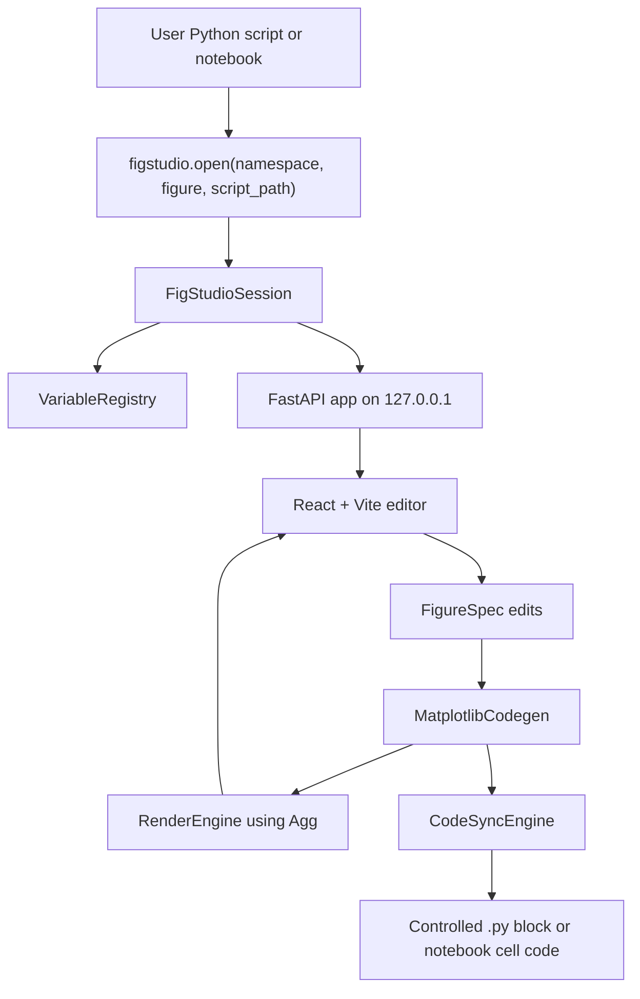
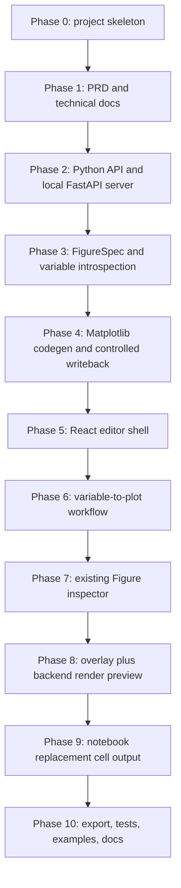

# FigStudio Technical Design

## Architecture

FigStudio is a local Python-launched web application. Python owns data access, code generation, Matplotlib rendering, and writeback. React owns the editing interface and short-lived UI state.



## Technology Stack

- Python 3.11+ with `uv` and `pyproject.toml`.
- FastAPI and Uvicorn for the local API server.
- Pydantic models for session, variable, figure, render, save, and export payloads.
- Matplotlib Agg backend for authoritative rendering.
- pandas and numpy for variable introspection and data adaptation.
- React, TypeScript, Vite, Zustand, CodeMirror 6, and lucide-react for the browser editor.

## Public API

```python
figstudio.open(
    namespace=None,
    *,
    figure=None,
    script_path=None,
    block_id="main",
    mode="auto",
) -> FigStudioSession
```

`namespace` should normally be `locals()` or a dict containing variables needed by generated code. `figure` may be a Matplotlib `Figure` for inspection and style patching. `script_path` enables automatic controlled-block writeback for `.py` files. Notebook workflows should omit `script_path` and copy the returned cell code.

## Core Components

- `VariableRegistry`: stores actual objects server-side and exposes safe summaries only.
- `FigureSpec`: declarative source of truth for figure, axes, layers, annotations, style, and export settings.
- `MatplotlibCodegen`: converts `FigureSpec` into plain Matplotlib OO code.
- `FigureInspector`: creates a readable tree from an existing Matplotlib `Figure` and approximates editable supported artists.
- `CodeSyncEngine`: replaces a unique controlled block and rejects missing, duplicate, or nested markers.
- `RenderEngine`: executes generated plotting code with Agg and returns PNG/SVG/PDF output.
- React editor: variable browser, canvas preview, layer tree, property inspector, code preview, save/export controls.

## API Endpoints

- `GET /api/session`
- `GET /api/variables`
- `GET /api/spec`
- `POST /api/spec`
- `POST /api/render`
- `POST /api/save-code`
- `POST /api/export`
- `WS /api/events`

## Implementation Flow



## Safety Decisions

- Generated code must not require FigStudio to reproduce a figure.
- Script writeback must only touch a single selected marker block.
- The server binds to `127.0.0.1`.
- Notebook files are not modified directly in v1.
- Existing Figure support is best-effort inspection plus supported style patching, not full source recovery.
