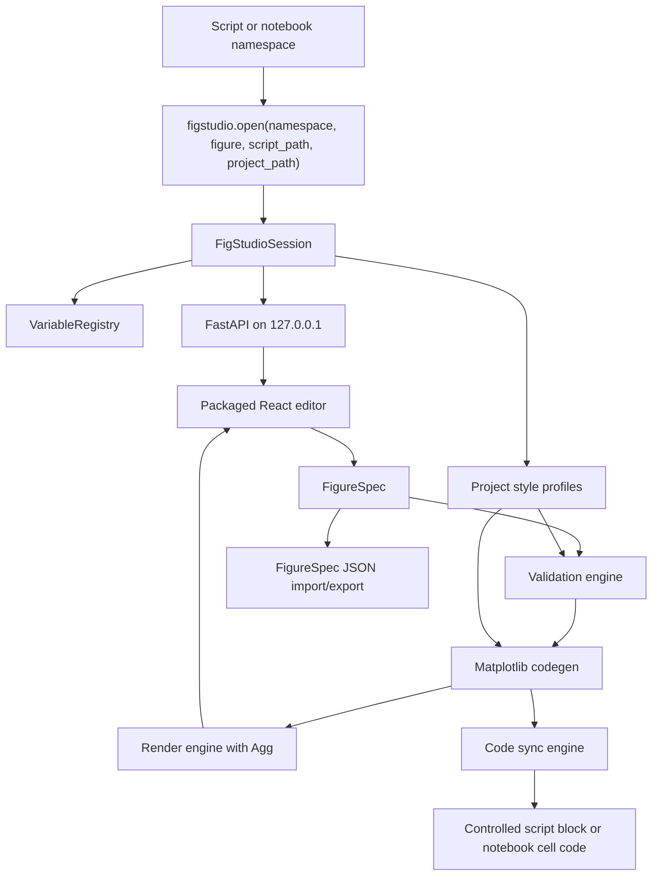

# 技术设计

本文是 public beta 的实现基准。用户教程放在用户文档，API 细节放在 [API 参考](../reference/api.md)，未来工作放在 [路线图](../product/roadmap.md)。

## 架构

FigStudio 是 Python 负责核心能力、本地 React 负责编辑界面的应用。Python 负责数据访问、校验、Matplotlib 渲染、代码生成、导出、受控写回和包内静态资源服务。React 负责 editor state、变量/layer/recipe 控件、annotations、preview display、validation display、FigureSpec import/export 和用户操作。

## 模块职责

- `session.py`：创建 `FigStudioSession`，解析项目根目录，选择 localhost port，启动 Uvicorn，打开浏览器，并检查可选已有 figure。
- `registry.py`：保存 live Python objects，并向 UI 暴露安全 `VariableSummary` records。
- `models.py`：定义 Pydantic request、response、error、session、validation 和 FigureSpec models。
- `style_profiles.py`：加载 `.figstudio/styles.json`，报告非致命 warnings，并在不修改 `FigureSpec` 的前提下解析 profile defaults。
- `validation.py`：校验 layout geometry、缺失变量/列、非 DataFrame recipe sources、缺失 axes、dimension mismatches、二维要求和 log-scale positivity，并在有上下文时添加 field-level repair suggestions。
- `codegen.py`：把 `FigureSpec` 转换为纯 Matplotlib OO code，不引入 FigStudio runtime dependency。
- `render.py`：在 Agg backend 下用 live namespace 执行生成代码，并返回 preview/export bytes。
- `sync.py`：替换唯一受控脚本块，并拒绝不安全 marker states。
- `server.py`：暴露本地 FastAPI app，并服务打包后的 React editor。
- `spec_io.py`：读取和保存可移植 `.figstudio.json` FigureSpec files。

## Data Flow

1. 用户代码调用 `figstudio.open(locals(), ...)`。
2. `VariableRegistry` 过滤 private names，并摘要受支持的 values。
3. `FigStudioSession` 依据 `project_path`、`script_path` 或当前工作目录解析 project root。
4. FastAPI app 在 `127.0.0.1` 服务 React editor 和 `/api/*` endpoints。
5. Editor 加载 project style profiles，并创建或导入 `FigureSpec`。
6. Backend validation 基于 live namespace 和 loaded profile ids 校验 spec，并返回带可选 repair suggestions 的 structured issues。
7. Codegen 解析 effective profile values 并创建 Matplotlib OO code。
8. Render/export 用 Agg 执行生成代码。
9. Save code 要么替换受控脚本块，要么返回 notebook replacement code。

## 安全决策

- 本地服务默认绑定 `127.0.0.1`。
- UI 收到的是 summaries，不是任意 Python objects 的直接序列化副本。
- FigureSpec recipe entries 保存 recipe intent 和 column references，不保存原始 DataFrame contents。
- 生成绘图代码不得 import 或依赖 FigStudio。
- 生成绘图代码必须包含已解析的 profile values 作为普通 Matplotlib arguments，不能运行时查找 profile。
- 脚本写回只替换唯一受控 block，并拒绝缺失、重复、不匹配或嵌套 markers。
- Notebook workflows 返回 replacement code，不直接修改 Notebook files。
- Existing Figure support 是 inspection 加 supported artists 的 generated editable layers，不是 source-code recovery。
- API failures 使用结构化 error payloads，覆盖 validation、render、export 和 writeback paths。

## 打包

Python wheel 把构建后的 React app 放在 `figstudio/static` 下。FastAPI server 优先服务包内目录，只在开发环境 fallback 到 source-tree `frontend/dist`。

Hatch custom build hook 会在 clean checkout 中运行 `npm ci`，如果本地已有 `frontend/node_modules` 则复用，随后运行 `npm run build`，并把 `frontend/dist` 复制到 `src/figstudio/static`。`FIGSTUDIO_SKIP_FRONTEND_BUILD=1` 会跳过 npm build step，但仍复制已有 `frontend/dist`。

## 验证

- Backend behavior：`uv run --extra dev pytest`。
- Frontend build：`cd frontend`; `npm run build`。
- Frontend bundle guard：`cd frontend`; `npm run check:bundle`。
- Browser smoke：`cd frontend`; `npm run test:e2e`。
- Package build：`uv build`。
- Installed wheel smoke：创建干净 venv，安装 `dist\figstudio-*.whl`，运行 `figstudio demo --no-browser`，再从 `127.0.0.1` 获取 `/` 和 `/api/session`。
