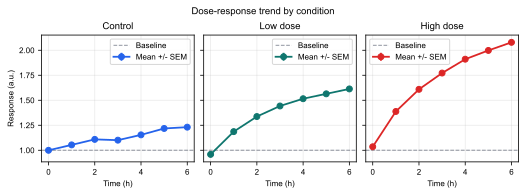
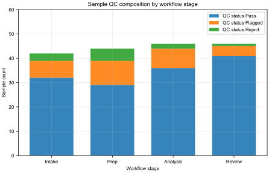
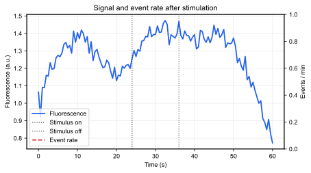
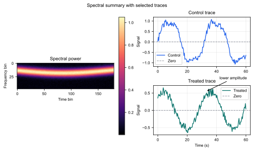

# Gallery

这个 gallery 是当前 beta 功能的一组小型、已提交 proof set。每个 workflow 都包含可运行的 Python script、配套 `.figstudio.json` figure contract，以及由该 contract 生成的 SVG preview。

在仓库根目录运行一个 workflow script 即可打开 live editor：

```powershell
uv run python examples/gallery/faceted_dose_response.py
```

配套 spec 是可移植的 FigStudio state。它们保存 variable names、columns、panel layout、filters、selections、reference lines、annotations 和 style choices，不保存 raw data。

## Faceted Dose Response



| 项目 | 说明 |
| --- | --- |
| Files | [script](../../examples/gallery/faceted_dose_response.py), [spec](../../examples/gallery/faceted_dose_response.figstudio.json) |
| Demonstrates | DataFrame-backed facet filters、`mean_sem_line` recipes、shared axes、reference lines、journal double-column sizing |
| Data shape | Synthetic repeated-measures DataFrame，包含 `condition`、`replicate`、`time` 和 `response` columns |
| Figure contract | 三个 panels 按 condition 过滤同一个 `df`，并从 live DataFrame columns 生成 plain Matplotlib recipe code |

## Stacked Bar Sample Composition



| 项目 | 说明 |
| --- | --- |
| Files | [script](../../examples/gallery/stacked_bar_sample_composition.py), [spec](../../examples/gallery/stacked_bar_sample_composition.figstudio.json) |
| Demonstrates | `stacked_bar` recipes、grouped count aggregation、publish-mode labels、SVG export readiness checks |
| Data shape | Synthetic sample QC DataFrame，包含 `sample_id`、`stage` 和 `qc_status` columns |
| Figure contract | 一个 recipe 按 workflow stage 和 QC status 对 live `df` 分组，把 counts 堆叠成 plain Matplotlib bars，并在 SVG export-context validation 下保持 clean |

## Secondary-Axis Timecourse



| 项目 | 说明 |
| --- | --- |
| Files | [script](../../examples/gallery/secondary_axis_timecourse.py), [spec](../../examples/gallery/secondary_axis_timecourse.figstudio.json) |
| Demonstrates | Left/right Y-axis overlay、combined legend、vertical reference lines、arrow annotation、export-ready sizing |
| Data shape | 一个 DataFrame，包含对齐的 `time`、`fluorescence`、`event_rate` 和 `stimulus` columns |
| Figure contract | Fluorescence line 留在 primary axis，event rate 通过 `AxesSpec.secondary_y` 渲染到右侧 Y 轴 |

## Spanned Layout Signal Map



| 项目 | 说明 |
| --- | --- |
| Files | [script](../../examples/gallery/spanned_layout_signal_map.py), [spec](../../examples/gallery/spanned_layout_signal_map.figstudio.json) |
| Demonstrates | GridSpec span output、heatmap colorbar、mapping-key repeated panel selections、annotations、baseline reference lines |
| Data shape | 共享 `time`、一个 `signal_map` dictionary 和一个 2D `spectral_power` array |
| Figure contract | 大 heatmap 跨两行，selected mapping entries 作为独立 trace panels 渲染 |

## Verification

Gallery examples 由 `tests/test_gallery_examples.py` 覆盖。该测试会在不打开 editor 的情况下 import 每个 script、加载配套 spec、用 script namespace 验证它，并运行 Matplotlib code generation。
