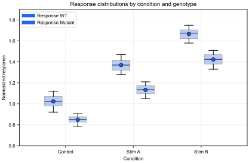
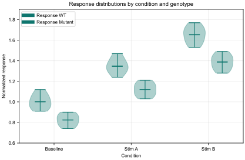
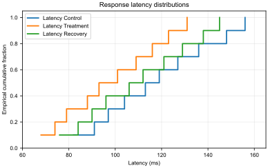
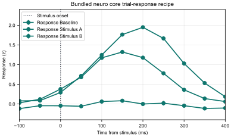
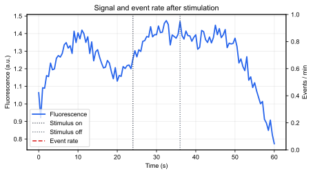
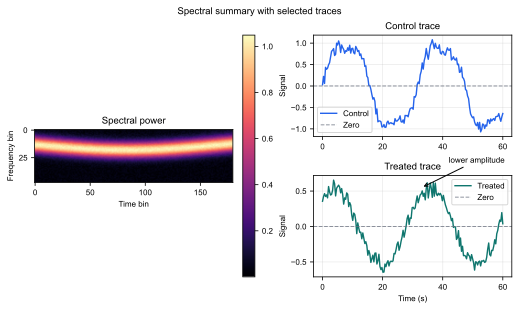

# Gallery

这个 gallery 是当前 beta 功能的一组小型、已提交 proof set。每个 workflow 都包含可运行的 Python script、配套 `.figstudio.json` figure contract，以及由该 contract 生成的 SVG preview。

在仓库根目录运行一个 workflow script 即可打开 live editor：

```powershell
uv run python examples/gallery/faceted_dose_response.py
```

配套 spec 是可移植的 FigStudio state。它们保存 variable names、columns、panel layout、filters、selections、reference lines、annotations 和 style choices，不保存 raw data。

## README Screenshot Set

README 使用这个已提交 gallery 中最小的三张 preview，让新用户在打开完整文档前就能看到可复现的视觉证据：

| README screenshot | 对应 workflow | 选择原因 |
| --- | --- | --- |
| [Faceted dose response](../assets/gallery/faceted-dose-response.svg) | [script](../../examples/gallery/faceted_dose_response.py), [spec](../../examples/gallery/faceted_dose_response.figstudio.json) | 展示 DataFrame facets、recipes、reference lines 和 publication sizing 的 data-to-preview 流程 |
| [Stacked bar sample composition](../assets/gallery/stacked-bar-sample-composition.svg) | [script](../../examples/gallery/stacked_bar_sample_composition.py), [spec](../../examples/gallery/stacked_bar_sample_composition.figstudio.json) | 展示带 grouped aggregation 和 export-readiness checks 的紧凑 recipe workflow |
| [Neuro ephys event rate](../assets/gallery/neuro-ephys-event-rate.svg) | [script](../../examples/gallery/neuro_ephys_event_rate.py), [spec](../../examples/gallery/neuro_ephys_event_rate.figstudio.json) | 展示不依赖 external pack loading 的 bundled experimental domain recipe 方向 |

## Short Workflow GIF References

仓库 proof set 不需要提交额外 binary GIF 文件。需要为 project pages 或 release material 录制短 demo GIF 时，从这些已提交 workflows 录制：

| GIF reference | Capture path |
| --- | --- |
| Data to faceted preview | 启动 `examples/gallery/faceted_dose_response.py`，选择 repeated-measures DataFrame，渲染 three-panel preview，然后导出 SVG。 |
| Recipe to export artifact | 启动 `examples/gallery/stacked_bar_sample_composition.py`，检查 stacked recipe mapping，预览 grouped counts，然后导出 SVG。 |
| Domain recipe proof | 启动 `examples/gallery/neuro_ephys_event_rate.py`，检查 bundled neuro recipe，预览 mean/SEM event rates，然后导出 SVG。 |

## Faceted Dose Response


| 项目 | 说明 |
| --- | --- |
| Files | [script](../../examples/gallery/faceted_dose_response.py), [spec](../../examples/gallery/faceted_dose_response.figstudio.json) |
| Demonstrates | DataFrame-backed facet filters、`mean_sem_line` recipes、shared axes、reference lines、journal double-column sizing |
| Data shape | Synthetic repeated-measures DataFrame，包含 `condition`、`replicate`、`time` 和 `response` columns |
| Figure contract | 三个 panels 按 condition 过滤同一个 `df`，并从 live DataFrame columns 生成 plain Matplotlib recipe code |

## Stacked Bar Sample Composition


| 项目 | 说明 |
| --- | --- |
| Files | [script](../../examples/gallery/stacked_bar_sample_composition.py), [spec](../../examples/gallery/stacked_bar_sample_composition.figstudio.json) |
| Demonstrates | `stacked_bar` recipes、grouped count aggregation、publish-mode labels、SVG export readiness checks |
| Data shape | Synthetic sample QC DataFrame，包含 `sample_id`、`stage` 和 `qc_status` columns |
| Figure contract | 一个 recipe 按 workflow stage 和 QC status 对 live `df` 分组，把 counts 堆叠成 plain Matplotlib bars，并在 SVG export-context validation 下保持 clean |

## Category Boxplot Response



| 项目 | 说明 |
| --- | --- |
| Files | [script](../../examples/gallery/category_boxplot_response.py), [spec](../../examples/gallery/category_boxplot_response.figstudio.json) |
| Demonstrates | `boxplot_by_category` recipes、grouped distribution summaries、publish-mode labels、SVG export readiness checks |
| Data shape | Synthetic response DataFrame，包含 `condition`、`genotype`、`replicate` 和 `response` columns |
| Figure contract | 一个 recipe 按 condition 和 genotype 对 live `df` values 分组，按 group 偏移 Matplotlib boxplots，并让 generated code 不依赖 FigStudio |

## Category Violin Response



| 项目 | 说明 |
| --- | --- |
| Files | [script](../../examples/gallery/category_violin_response.py), [spec](../../examples/gallery/category_violin_response.figstudio.json) |
| Demonstrates | `violin_by_category` recipes、grouped distribution summaries、publish-mode labels、SVG export readiness checks |
| Data shape | Synthetic response DataFrame，包含 `condition`、`genotype`、`replicate` 和 `response` columns |
| Figure contract | 一个 recipe 按 condition 和 genotype 对 live `df` values 分组，按 group 偏移 Matplotlib violins，并让 generated code 不依赖 FigStudio |

## ECDF Response Distribution



| 项目 | 说明 |
| --- | --- |
| Files | [script](../../examples/gallery/ecdf_response_distribution.py), [spec](../../examples/gallery/ecdf_response_distribution.figstudio.json) |
| Demonstrates | `ecdf` recipes、grouped empirical cumulative distributions、publish-mode labels、SVG export readiness checks |
| Data shape | Synthetic response latency DataFrame，包含 `cohort`、`sample_id` 和 `latency_ms` columns |
| Figure contract | 一个 recipe 在每个 cohort 内排序 live `df` values，绘制 Matplotlib step ECDF curves，并让 generated code 不依赖 FigStudio |

## Neuro Core Trial Response



| 项目 | 说明 |
| --- | --- |
| Files | [script](../../examples/gallery/neuro_core_trial_response.py), [spec](../../examples/gallery/neuro_core_trial_response.figstudio.json) |
| Demonstrates | `neuro.core.trial_response_timecourse` 作为 bundled experimental recipe、grouped trial-aligned responses、stimulus-onset reference lines、SVG export readiness checks |
| Data shape | Synthetic trial-aligned neuroscience DataFrame，包含 `condition`、`trial_id`、`time_ms` 和 `response_z` columns |
| Figure contract | 一个 namespaced core recipe 按 time 和 condition 汇总 live `df` response values，绘制 Matplotlib mean/SEM timecourses，并在不引入 external pack loading 的情况下保持 neuroscience surface bundled |

## Neuro Ephys Event Rate


| 项目 | 说明 |
| --- | --- |
| Files | [script](../../examples/gallery/neuro_ephys_event_rate.py), [spec](../../examples/gallery/neuro_ephys_event_rate.figstudio.json) |
| Demonstrates | `neuro.ephys.event_rate_timecourse` 作为 bundled experimental recipe、grouped event-rate summaries、publish-mode labels、SVG export readiness checks |
| Data shape | Synthetic electrophysiology DataFrame，包含 `condition`、`unit_id`、`time_s` 和 `event_rate_hz` columns |
| Figure contract | 一个 namespaced recipe 按 time 和 condition 汇总 live `df` event-rate values，绘制 Matplotlib mean/SEM timecourses，并在不引入 external pack loading 的情况下证明 bundled neuroscience-pack 方向 |

## Secondary-Axis Timecourse



| 项目 | 说明 |
| --- | --- |
| Files | [script](../../examples/gallery/secondary_axis_timecourse.py), [spec](../../examples/gallery/secondary_axis_timecourse.figstudio.json) |
| Demonstrates | Left/right Y-axis overlay、combined legend、vertical reference lines、arrow annotation、export-ready sizing |
| Data shape | 一个 DataFrame，包含对齐的 `time`、`fluorescence`、`event_rate` 和 `stimulus` columns |
| Figure contract | Fluorescence line 留在 primary axis，event rate 通过 `AxesSpec.secondary_y` 渲染到右侧 Y 轴 |

## Spanned Layout Signal Map



| 项目 | 说明 |
| --- | --- |
| Files | [script](../../examples/gallery/spanned_layout_signal_map.py), [spec](../../examples/gallery/spanned_layout_signal_map.figstudio.json) |
| Demonstrates | GridSpec span output、heatmap colorbar、mapping-key repeated panel selections、annotations、baseline reference lines |
| Data shape | 共享 `time`、一个 `signal_map` dictionary 和一个 2D `spectral_power` array |
| Figure contract | 大 heatmap 跨两行，selected mapping entries 作为独立 trace panels 渲染 |

## Verification

Gallery examples 由 `tests/test_gallery_examples.py` 覆盖。该测试会在不打开 editor 的情况下 import 每个 script、加载配套 spec、用 script namespace 验证它，并运行 Matplotlib code generation。
