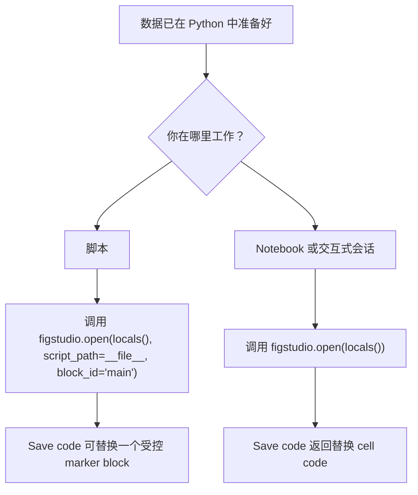

# 快速开始

本页帮助 Scientific Python 用户从安装走到第一张可编辑 Matplotlib 图。

## 安装

```powershell
pip install figstudio
```

安装构建好的 wheel 后，包内已经包含浏览器编辑器。普通用户不需要 Node、npm、Vite 或前端源码目录。

## 运行 Demo

```powershell
figstudio demo
```

该命令会在 `127.0.0.1` 启动本地服务、打印 editor URL，并在未传入 `--no-browser` 时打开浏览器。

## 选择启动路径



## 第一个脚本会话

在数据准备完成后调用 FigStudio，并为生成绘图代码预留一个 marker block：

```python
import figstudio

# 在这一行上方读取、清洗并汇总数据。
session = figstudio.open(locals(), script_path=__file__, block_id="main")

# figstudio:start main
# figstudio:end main
```

点击 **Save code** 时，FigStudio 只替换匹配 marker 中间的代码。它不会编辑 marker 之外的 imports、数据读取、过滤、建模或其他代码。

如果同一个脚本里有多张生成图，为每张图使用不同的 `block_id`。

## 第一个 Notebook 会话

Notebook 或交互式会话应省略 `script_path`：

```python
import figstudio

session = figstudio.open(locals())
```

编辑器仍可映射数据、渲染预览、导出文件并生成代码。**Save code** 会在响应和代码面板里返回替换 cell code，不会直接修改 Notebook 文件。

## 创建第一张 DataFrame 图

1. 打开 FigStudio 前，先完成数据读取、清洗、筛选、建模和汇总计算。
2. 在左侧 **Variables** 面板选择 pandas DataFrame。
3. 选择 **Plot layer** 创建直接图层，或选择 **Stats recipe** 创建常见统计图版。
4. 选择图形或 recipe 类型。
5. 映射 X/Y/value 列。
6. 点击 **Add layer** 或 **Add recipe**，等待 Matplotlib 预览。
7. 第一张预览渲染成功后，继续阅读 [科研制图工作流](scientific-workflows.md)。

公开变量摘要支持 pandas DataFrame/Series、NumPy array、list、tuple 和 Matplotlib Figure。以下划线 `_` 开头的变量会被隐藏。
