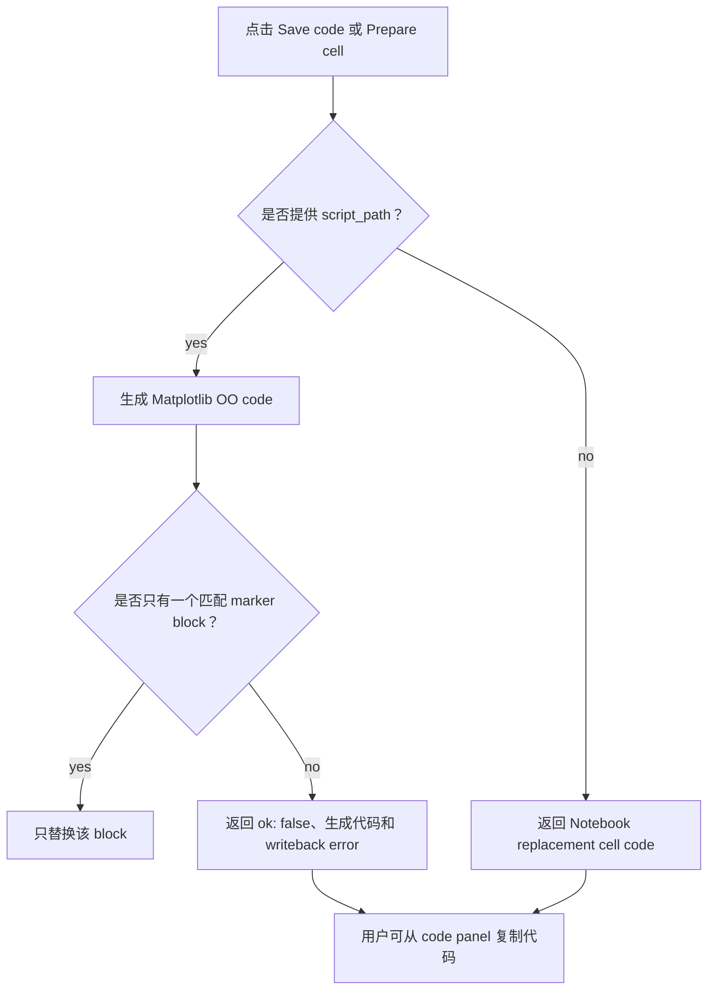

# 保存、导出与复用

当图形准备离开 editor，成为代码、文件或可复用编辑会话时，阅读本页。

## 安全保存代码



脚本写回只能替换唯一受控块：

```python
# figstudio:start main
# generated code goes here
# figstudio:end main
```

FigStudio 会拒绝缺失 block、同一 id 的重复 block、嵌套 markers、不匹配 markers 和 IO failures。它不会编辑受控块之外的代码。脚本写回被阻止时，生成的 replacement 仍会显示在 code panel 中。

Notebook 风格或 no-script 会话返回替换 cell code，不直接修改 Notebook 文件。在这些会话中，toolbar 显示 **Prepare cell**。点击后，code panel 会切换为 **Notebook replacement cell**，并启用 copy button，方便用户主动粘贴到 Notebook。

## 导出文件

使用 preview toolbar 中的 PNG、SVG 或 PDF 导出按钮。导出由 Matplotlib Agg 根据当前 `FigureSpec` 生成，因此导出文件匹配 generated Matplotlib code path，而不是浏览器近似渲染。

如果导出失败，先修复 validation issues。如果 validation 已通过但导出仍失败，且你使用了明确 output path，请检查文件系统权限。

## 复用 FigureSpec 文件

使用 FigureSpec import/export 按钮保存或恢复 `.figstudio.json` GUI 会话。

`FigureSpec` 保存的是 editor state，不保存原始数据。复用 spec 需要新的 Python session 提供兼容的变量名、DataFrame 列、facet filter values 和数据形状。

也可以使用 Python helper：

```python
figstudio.save_spec(session.spec, "figure.figstudio.json")
spec = figstudio.load_spec("figure.figstudio.json")
```

项目 style profile 引用也依赖下一次 session 中兼容的 `.figstudio/styles.json` 内容。缺失 profile id 会 warning，并 fallback 到 spec 显式值和 defaults。
