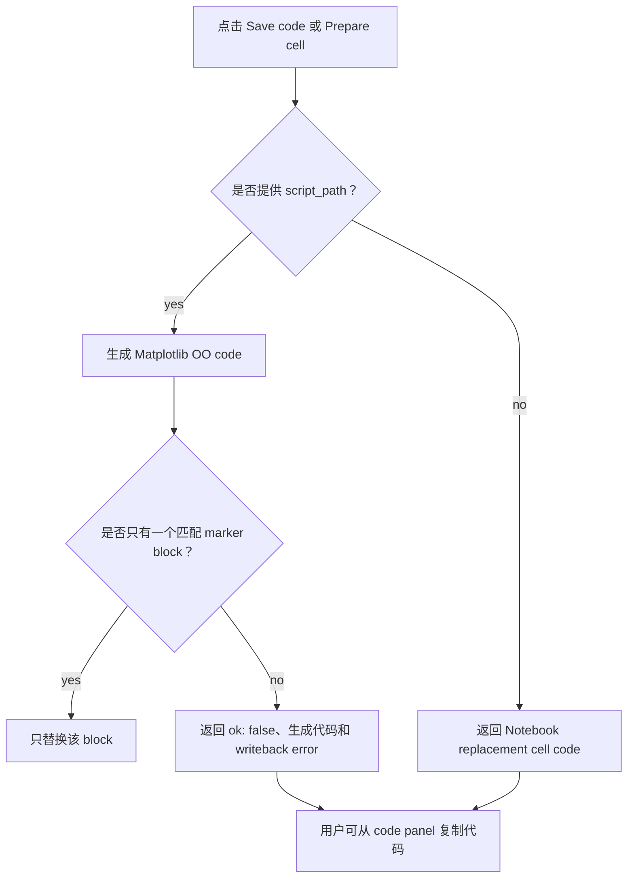

# 保存、导出与复用

需要把 editor 中的图形保存为代码、导出为文件，或保留编辑状态以便复用时，阅读本页。

## 安全保存代码


```mermaid
flowchart TD
  A["点击 Save code 或 Prepare cell"] --> B{"是否提供 script_path？"}
  B -->|yes| C["生成 Matplotlib OO code"]
  C --> D{"是否只有一个匹配 marker block？"}
  D -->|yes| E["只替换该 block"]
  D -->|no| F["返回 ok: false、生成代码和 writeback error"]
  B -->|no| G["返回 Notebook replacement cell code"]
  F --> H["用户可从 code panel 复制代码"]
  G --> H
```

脚本写回只能替换唯一受控块：

```python
# figstudio:start main
# generated code goes here
# figstudio:end main
```

FigStudio 会拒绝缺失 block、同一 id 的重复 block、嵌套 markers、不匹配 markers 和 IO failures。它不会编辑受控块之外的代码。脚本写回被阻止时，生成的 replacement 仍会显示在 code panel 中。

从 Notebook 启动或未提供脚本时，FigStudio 会返回替换 cell code，不直接修改 Notebook 文件。此时 toolbar 显示 **Prepare cell**。点击后，code panel 会切换为 **Notebook replacement cell**，并启用 copy button，方便用户主动粘贴到 Notebook。

## 导出文件

使用 preview toolbar 中的 PNG、SVG 或 PDF 导出按钮。导出由 Matplotlib Agg 根据当前 `FigureSpec` 生成，因此导出文件匹配 generated Matplotlib code path，而不是浏览器近似渲染。

如果导出失败，先修复 validation issues。如果 validation 已通过但导出仍失败，且你使用了明确 output path，请检查文件系统权限。

## 复用 FigureSpec 文件

使用 FigureSpec import/export 按钮保存或恢复 `.figstudio.json` GUI 编辑状态。

`FigureSpec` 保存的是 editor state，不保存原始数据。再次使用时，Python 环境仍需提供兼容的变量名、DataFrame 列、facet filter values 和数据形状。

也可以使用 Python helper：

```python
figstudio.save_spec(session.spec, "figure.figstudio.json")
spec = figstudio.load_spec("figure.figstudio.json")
```

项目 style profile 引用也依赖下次打开时可用的 `.figstudio/styles.json` 内容。找不到 profile id 时会给出 warning，并改用 spec 中的显式值和默认值。
