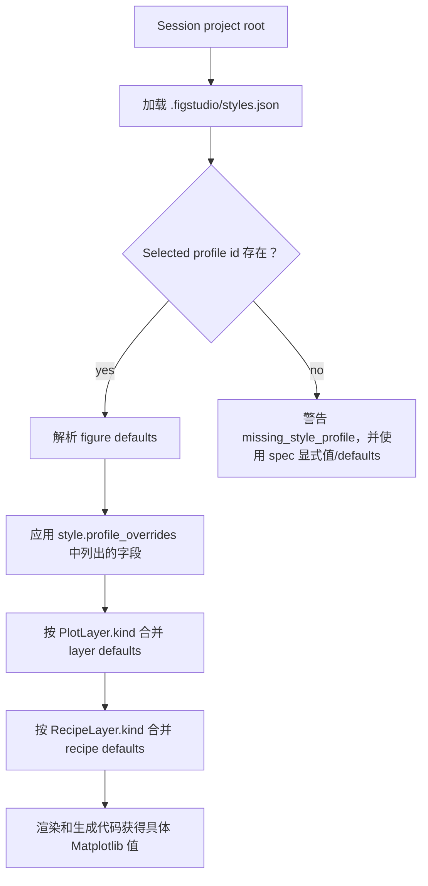

# 样式与布局

当图形需要 manuscript sizing、一致的项目默认值或多面板布局时，阅读本页。

## 内置 Figure Presets

FigStudio 会在 `FigureStyle.preset` 中记录内置 figure preset。当前值为 `custom`、`journal_single`、`journal_double`、`poster` 和 `slide`。

Presets 是起点。你仍可编辑 figure width、height、DPI、font family、font size 和 constrained layout。

## Panel Layouts

Panel layout presets 包括 single panel、two columns、two rows、two by two、large left 和 large top。

Editor 把 layout 存成 axes geometry：`row`、`col`、`rowspan` 和 `colspan`。每个 axes 占一个 cell 的 dense grid 会生成更简单的 `plt.subplots` 代码，并可传递 shared X/Y flags。带 span 或非 dense layout 会生成 Matplotlib `GridSpec` 代码。

完整 `subplot_mosaic` authoring 不属于当前 schema。

## 项目 Style Profiles

项目可以在 session project root 下的 `.figstudio/styles.json` 中提供共享 figure、layer 和 recipe 默认值：

```json
{
  "version": 1,
  "profiles": [
    {
      "id": "manuscript",
      "label": "Manuscript",
      "description": "Compact manuscript defaults",
      "figure": {
        "width": 3.35,
        "height": 2.45,
        "dpi": 300,
        "font_family": "Arial",
        "font_size": 8,
        "constrained_layout": true
      },
      "layers": {
        "line": { "color": "#2563eb", "linewidth": 1.6 }
      },
      "recipes": {
        "mean_sem_line": { "color": "#2563eb", "linewidth": 1.6 }
      }
    }
  ]
}
```

提供 `script_path` 时，FigStudio 会在脚本目录下查找。没有 `script_path` 时，会使用当前工作目录。也可以通过 `figstudio.open(..., project_path=...)` 或 CLI `--project` 指定其他根目录。

## Profile Resolution



选择 profile 后，`FigureSpec` 会保存 `style.profile_id`。Profile values 不会复制进 spec。

如果你手动修改 width、height、DPI、font family、font size 或 constrained layout 等受管理字段，FigStudio 会把该字段记录到 `style.profile_overrides`，让手动值优先。

Layer 和 recipe style defaults 按 kind 解析。Layer 或 recipe 上显式非 null 的 style 字段会覆盖继承 profile defaults。
